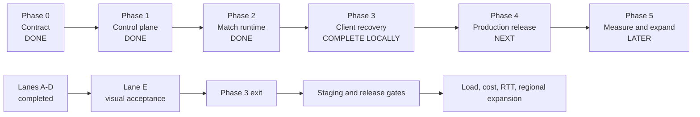
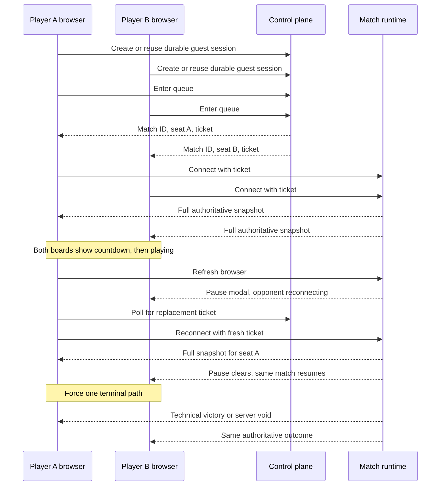

# Handoff: Lane E — Phase 3 acceptance verification

## Mission

Lane E is the only remaining Phase 3 lane. Its job is to run the final
acceptance check against the real client and record what is ready for Phase 4.

This handoff is now a visual verification guide, not a plan to redo Lanes A
through D. It should expose defects, not redesign protocols or make tests pass
by weakening assertions.

The source of truth is the Phase 3 handoff acceptance criteria and
`production-architecture.md`, “Phase 3: client recovery and protocol”.

## Phase status

The architecture plan in `production-architecture.md` defines five delivery
phases. The current project status is:



| Phase | Status | What is true | What remains |
|---|---|---|---|
| Phase 0 | Done | Contract and architecture are frozen | No Phase 0 work |
| Phase 1 | Done | Durable identity, sessions, queue, assignments, tickets, results, health, and migrations exist | No Phase 1 work |
| Phase 2 | Done | Isolated `MatchRunner` instances, ticket binding, checkpoints, recovery, drain, and multiple 1v1 matches exist | No Phase 2 work |
| Phase 3 | Complete locally | Lanes A through E pass local implementation and acceptance checks | Discord Activity staging visual evidence |
| Phase 4 | Next | Release plan is defined | Staging deployment, Pages wiring, production secrets/CORS, metrics, snapshots, rollback, mappings, and six release gates |
| Phase 5 | Later | Expansion triggers are defined | Capacity, billing, real Discord RTT, soak evidence, and regional expansion decisions |

### What can start now

Phase 4 preparation can start while Lane E is being verified:

- create the isolated Railway staging environment and staging Postgres;
- prepare Pages preview wiring and environment-specific `game-config.json`;
- prepare migration-before-listen deployment checks;
- prepare structured-log, Sentry, Railway metrics, spend, snapshot, smoke,
  and rollback runbooks;
- confirm the permanent Discord mappings needed for staging and launch.

Do not call Phase 4 complete until Phase 3 passes its exit criteria and all six
release gates pass.

Phase 5 planning can start now. Phase 5 measurements should wait until Phase 4
has a stable staging or production-like deployment. Load and billing results
from local development do not count as launch evidence.

### Phase 4 checklist after Phase 3

```text
[ ] Railway staging environment and staging Postgres
[ ] Pages preview and production wiring
[ ] Migration-before-listen deployment
[ ] Structured logs, Sentry, Railway metrics, spend limits, daily snapshots
[ ] Release smoke and rollback runbooks
[ ] Permanent Discord mappings

Release gates
[ ] Production Pages wiring
[ ] Database-backed /health
[ ] 180-second drain configuration
[ ] Additive migrations
[ ] Secret and production CORS audit
[ ] Active spend cap
```

### Phase 5 checklist

```text
[ ] Multi-match load test with CPU, memory, event-loop, database, and egress
[ ] Real Discord Activity RTT and reconnect evidence
[ ] Billing review using active match-hours
[ ] Decide whether the Virginia launch topology still fits
[ ] Add Europe and /region-eu only if the placement trigger is met
[ ] Export analytics only if the ticket 07 thresholds are crossed
```

## Current evidence

Already demonstrated or covered in the current branch:

- Two isolated 1v1 matches can run in one process without cross-talk.
- Healthy-runtime seat replacement and full snapshot delivery.
- Process restart/checkpoint recovery and server-void paths.
- Guest session and bounded recovery polling.
- Stable protocol rejection codes in the database-backed integration test.
- Discord bootstrap reuses the same internal player identity.
- Pause, forfeit, server-void, and protocol-mismatch UI paths exist.

These are separate evidence points. Phase 3 is complete only when the
acceptance matrix passes with the real client flow and no untested required
column remains.

## Phase E result

The local Phase E implementation and acceptance checks are complete.

| Check | Result | Evidence |
|---|---|---|
| TypeScript | PASS | `bun run lint` |
| Production build | PASS | `bun run build` |
| Normal aggregate server suite | PASS | `bun run test`, 222 tests |
| Full serial repository suite | PASS | `bun test --max-concurrency=1`, 258 tests |
| Ticket-authenticated production smoke | PASS | `bun run test:smoke` |
| Direct browser on `localhost:3000` | PASS | Ticket connected, consumed, seat A, match playing |
| Direct browser on `127.0.0.1:3000` | PASS | Ticket connected, consumed, seat B, same match playing |
| Refresh during playing | PASS | Player A reclaimed the same match and seat; Player B remained in the match |
| Restart, corrupt checkpoint, and restore timeout | PASS | Control-plane integration tests |
| Discord identity reuse | PASS | Automated Discord bootstrap integration test |
| Discord Activity visual remount | BLOCKED | No staging Activity mapping or credentials are configured locally |

The blocked Discord row is an environment evidence gap. It is not a failing
implementation test. Phase 4 can prepare the staging mapping, then rerun only
that visual row.

## Visual test

Run this with two browser windows. Use one window for each player. Open the
windows on the same origin first, then repeat the refresh test with the second
origin.



### Manual visual steps

| Step | Action | What should be visible |
|---|---|---|
| 1 | Open two clients and queue both players | Each client leaves the queue and shows “Match assigned — connecting...” |
| 2 | Wait for the match | Both clients show the same countdown and then live boards |
| 3 | Refresh Player A during `playing` | Player B shows “Match paused” and “Your opponent is reconnecting.” |
| 4 | Wait for Player A to reclaim the seat | Player A shows “Reconnecting to the match...”; both clients return to the same match |
| 5 | Compare both boards and scores | The board, score, tick, shop, and opponent state do not reset |
| 6 | Disconnect Player A until the budget expires | Player B sees a technical victory, not a server void |
| 7 | Repeat with a controlled runtime restore timeout | Both clients see “Match voided — no winner.” |
| 8 | Try a stale ticket or protocol mismatch | The client stops retrying and shows reload/update guidance |
| 9 | Repeat steps 1 through 5 from `localhost` and `127.0.0.1` | Both direct-web origins complete the same flow |
| 10 | Repeat the identity flow in Discord Activity staging | Remount returns to the same Discord-backed player and seat |

Mark each row `PASS`, `FAIL`, or `BLOCKED`. A blocked row needs the exact
environment reason. It is not a pass.

## Decided

- Direct web verification uses `http://localhost:3000` and
  `http://127.0.0.1:3000` as separate origins.
- Discord verification uses the mapped Activity origin, not a raw provider
  hostname.
- The test must assert durable player ID, match ID, seat, protocol version,
  ticket consumption, and authoritative state.
- A browser refresh/remount is different from opening a second independent
  client.
- A server void is a pass only when no winner is shown.
- Analytics failures are non-blocking and must be tested as such.
- Test databases and rows are isolated and cleaned after every scenario.

## Lane E acceptance matrix

The rows below are the final Phase 3 checks. The completed lanes provide the
behavior being checked. They are not reopened by Lane E.

| Scenario | Clients | Required assertions |
|---|---|---|
| Fresh guest bootstrap | One direct-web client | Guest session created, assignment polling begins, no token appears in UI |
| Queue pairing | Two direct-web clients | Same match ID, distinct durable players and seats |
| Two-match isolation | Four clients | Exactly two match IDs; each runtime has only its own two players |
| Refresh during queue | One client plus opponent/queue | Same durable identity; no duplicate queue entry or player |
| Refresh during playing | Two clients | Same match and seat; opponent is not reset; full snapshot replaces stale state |
| React remount/StrictMode | Controlled client harness | No duplicate sockets, handlers, assignment polls, or analytics storms |
| Healthy socket loss | Two clients | Pause appears, bounded ticket refresh runs, match resumes from server state |
| Stale/consumed ticket | Socket harness | Stable rejection; fresh ticket path does not retry the consumed ticket |
| Wrong player/seat | Socket harness | Rejected before game state; legitimate seats remain unchanged |
| Third socket | Three attempts in one match | Third attempt rejected; no seat displacement |
| Protocol mismatch | Socket harness | Stable mismatch code, reload guidance, no retry loop |
| Disconnect forfeit | Two clients | Correct technical winner; distinct from server void |
| Server restart | Two clients and replacement server | Same match/seats; checkpoint restore within budget; authoritative snapshot resumes |
| Restore timeout/corrupt checkpoint | Controlled recovery harness | Match finalized once as void; both clients see no winner |
| Discord first launch/remount | Mapped Activity client | Same Discord identity maps to same internal player and reclaims the same seat |
| Analytics outage | Client with analytics endpoint failure | Rendering, reconnect, simulation, and result handling continue normally |

## Verification order

1. Run static/type checks and the focused Lane E test helpers.
2. Run the existing A-D regression tests once. Do not change their scope.
3. Run the direct-browser visual test on `localhost` and `127.0.0.1`.
4. Run the mapped Discord Activity test when staging credentials and mappings
   exist.
5. Inject analytics failure and repeat the visual recovery scenario.
6. Run the complete relevant suite and record environment limitations
   separately from product failures.

## Required evidence record

For each scenario capture:

- scenario name and timestamp;
- client origin and server origin;
- match ID;
- durable player IDs and seats;
- protocol version;
- connection phase transitions;
- authoritative status/end reason;
- checkpoint/recovery tick where applicable;
- expected versus observed result;
- test command or browser steps;
- cleanup confirmation.

Never record raw tickets, bearer tokens, Discord provider tokens, or full
socket IDs in the evidence artifact.

## Acceptance criteria

- Every matrix row has a passing automated or manual result.
- Both direct origins pass the guest refresh/remount path.
- Discord remount passes through the trusted identity bootstrap.
- Stale, wrong-player, wrong-seat, and third-socket cases are visibly safe.
- Reconnect does not reset the opponent’s match.
- Full authoritative snapshots replace stale client state.
- Protocol mismatch does not loop forever.
- Forfeit and void are visibly distinct.
- Analytics/replay failure cannot block gameplay.
- `bun run lint` passes.
- Relevant tests pass, followed by the complete Phase 3 suite.
- Any skipped test has a named environment blocker and is not reported as
  passed.

## Files and tools to inspect first

- `.scratch/production-multiplayer-deployment/handoff-phase-3-client-recovery-and-protocol.md`
- `server/controlPlane/protocolContract.integration.test.ts`
- `server/controlPlane/discordBootstrap.integration.test.ts`
- `server/controlPlane/processRestartRecovery.integration.test.ts`
- `server/GameManager.test.ts`
- `src/hooks/matchRecovery.test.ts`
- `src/hooks/useGameSocket.test.ts`
- `scripts/live-smoke.mts`
- `server/testHarness/smokeControl.test.ts`
- `src/App.tsx`
- `src/components/ServerDiagnosticsPanel.tsx`

## Dependencies and boundaries

- Lanes A through D are complete inputs to this final check.
- Lane C supplies the expected visible messages and outcome distinctions.
- Lane D supplies telemetry/replay assertions, but telemetry is never the
  authority for pass/fail match outcomes.
- The two-match demo is evidence for the matrix, not a substitute for a
  repeatable test.

Do not use Browser MCP as a hidden test dependency, rely on existing database
rows, accept a generic “connected” result as proof of seat reclaim, or change
production behavior solely to satisfy a test harness.

## Unknowns to resolve

1. Which browser harness can drive refresh/remount without making Browser MCP a
   repository test dependency?
2. Which staging Discord mapping and credentials are safe for repeatable tests?
3. How should screenshots, logs, and database evidence be retained without
   storing sensitive identity or ticket data?
4. Which complete-suite command avoids the repository’s current Bun
   `node:test`/glob interaction while retaining all test files?
