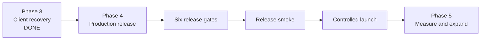

# Handoff: Phase 4 — production release

## Mission

Prepare Shape Showdown for a controlled production release using the agreed
topology:

```text
Direct web client       Cloudflare Pages
Discord Activity        Discord URL mappings → Cloudflare Pages
Game service             Railway Virginia
Control plane database   Railway Postgres
```

Phase 4 is complete only when the production lane is isolated from staging and
all six release gates pass with recorded evidence.

The source of truth is `production-architecture.md`, the release contract in
`issues/09-define-release-and-operations-contract.md`, and the runtime code.
Provider settings are not evidence until someone checks them in the dashboard
or with a repeatable command.

## Phase status



| Area | Current status | Evidence or remaining work |
|---|---|---|
| Phase 3 client recovery | Done | Direct web and Discord Activity live test passed |
| Railway staging service | Working | Staging Postgres, mappings, reconnect, pause, and void paths tested |
| Cloudflare Pages production client | Working | Production build deployed with Railway URL and Discord client ID |
| Railway production environment | Unknown | Create or verify a separate service and separate Postgres database |
| Production release gates | Not complete | Gates below need explicit evidence |
| Phase 5 capacity and cost study | Later | Do not use Phase 4 as a substitute for multi-match load testing |

## Decided

- Staging and production use separate Railway environments and databases.
- Direct web clients read `game-config.json`.
- Discord Activity requests stay relative and use Discord URL mappings.
- The production client must point to the production Railway service, not staging.
- Railway Postgres is the durable control-plane database.
- The server must pass its database-backed `/health` check before accepting
  traffic.
- Migrations run before the HTTP server begins listening.
- Schema changes remain additive and backward-compatible.
- Railway keeps one application replica while live match state is held in
  process memory.
- A draining deployment stops admitting new matches and gives active matches
  the configured drain window.
- Rollback must use a previous successful deployment without requiring a
  destructive database migration.
- No secret, provider token, database URL, or raw ticket belongs in git or
  visual evidence.

## Not part of Phase 4

- Increasing the number of regions.
- Choosing a different hosting provider.
- Replacing Postgres with Redis.
- Narrowing the full `GameState` wire protocol.
- Proving maximum simultaneous match capacity.
- Establishing real-world Discord latency across regions.
- Adding N-player matches or spectator mode.

Those are Phase 5 or later decisions.

## Work lanes

### Lane A: environments and wiring

Create or verify the isolated Railway production lane.

Required work:

- create the production Railway service;
- create or attach a production-only Postgres database;
- set the production database connection string using Railway private
  networking;
- configure the production public hostname;
- set the production `game-config.json` to the production game service;
- configure Cloudflare Pages production build variables;
- configure Discord root, API, health, and Socket.IO mappings for the
  production target;
- remove staging hosts from production configuration;
- verify production CORS allows the Pages origin and the Discord Activity
  origin required by the mapping flow;
- verify staging still points only to staging.

Acceptance:

- A production client cannot create a player in the staging database.
- A staging client cannot create a player in the production database.
- Direct web and Discord Activity clients reach the production service.
- `/api`, `/health`, and Socket.IO mappings reach the intended production
  host.

### Lane B: release safety and database changes

Make deployment behavior safe before promoting player traffic.

Required work:

- verify the startup sequence runs migrations before `listen`;
- verify migrations are additive;
- verify `/health` returns success only after the database ping and migration
  readiness check pass;
- configure Railway health checks and the 180-second drain window;
- verify `SIGTERM` marks the runtime as draining;
- verify new queue allocations stop during drain;
- verify active matches checkpoint and reconnect after a replacement process;
- confirm the old and new server versions can safely share the database during
  a rolling deployment;
- run a rollback using a previous successful deployment.

Acceptance:

- A failed database check prevents the service from presenting itself as
  ready.
- A deployment does not create a second winner, duplicate result, or orphaned
  ticket.
- An active match either resumes from its checkpoint or reaches the defined
  void outcome.
- The stable public hostname remains unchanged after rollback.

### Lane C: secrets, logs, metrics, and cost controls

Configure the operational controls that prevent a silent or expensive failure.

Required work:

- store `DATABASE_URL`, `DISCORD_CLIENT_ID`, and
  `DISCORD_CLIENT_SECRET` in Railway variables;
- store `VITE_DISCORD_CLIENT_ID` and the production game URL in the Pages
  production environment;
- check that no secret is present in the repository or generated client
  bundle;
- verify structured server logs include release, match, and correlation
  identifiers without tickets or bearer tokens;
- configure Sentry for the client and server, if the release plan still
  includes it;
- record Railway CPU, memory, public egress, and deployment metrics;
- configure the active Railway spend limit;
- enable the planned Postgres daily snapshot;
- record the accepted risk that PITR and a verified restore are deferred.

Acceptance:

- A production crash produces an actionable Sentry or Railway log event.
- A socket or control-plane failure can be traced without exposing a secret.
- The spend limit is visible and active in Railway Billing.
- A snapshot exists for the production database.

### Lane D: release evidence and operating runbooks

Run the final checks from the client through the production stack and capture
the result.

Required work:

- run a production health check;
- run the ticket-authenticated smoke test against the production service;
- open one direct web client and one Discord Activity client;
- pair the clients into one match;
- verify the match result is written to production Postgres;
- refresh one client during play and reclaim the same seat;
- disconnect one client and verify the pause and terminal outcome;
- redeploy while a match is connected;
- verify reconnect or the defined void path after deployment;
- roll back to the previous deployment;
- repeat health and smoke checks after rollback;
- record timestamps, deployment IDs, match IDs, seats, outcomes, and URLs;
- redact tickets, bearer tokens, Discord authorization codes, and full socket
  IDs from the evidence.

Acceptance:

- The release smoke passes before promotion.
- Deploy, reconnect, rollback, and health evidence all refer to the same
  production lane.
- The evidence distinguishes a technical win from a server void.
- No staging row or stale client is used as production evidence.

## Six production release gates

| Gate | Requirement | Evidence |
|---|---|---|
| 1. Wiring | Pages and Discord map to production Railway; production has its own Postgres | Config output, mapping capture, and health URL |
| 2. Health | Database-backed `/health` passes before traffic is accepted | HTTP response, migration status, Railway deployment log |
| 3. Drain | Railway gives active matches the configured 180-second grace period | Railway service setting and deploy-while-connected test |
| 4. Migrations | Schema changes are additive and safe for rollback | Migration review and startup log |
| 5. Secrets and CORS | No secrets are committed; production origins are explicit | Variable audit, bundle scan, CORS preflight |
| 6. Spend cap | Railway spending protection is configured and active | Billing settings capture or API output |

Do not mark a gate passed from a local `.env`, a local database, or a
successful staging request.

## Verification commands

Use the smallest relevant check first:

```text
bun run lint
bun run build
bun run test:control-plane
bun run test:manager
bun run test:smoke
railway status
railway metrics --environment production --network --json
```

The production smoke command must receive its production origin and must not
silently fall back to localhost or staging.

## Release evidence record

For every release candidate, record:

- git commit SHA;
- Pages deployment ID and production URL;
- Railway deployment ID and service URL;
- Railway environment name;
- database migration status;
- health response and timestamp;
- smoke result and timestamp;
- match ID and seats, with no tickets;
- reconnect, drain, and rollback outcomes;
- CPU, memory, and public egress window;
- spend-limit status;
- snapshot timestamp;
- known blockers or accepted risks.

## Rollback runbook

1. Stop promotion and announce the release ID.
2. Check `/health` and Railway deployment status.
3. If the new service is unhealthy, roll back to the last successful
   deployment.
4. Keep the database schema because Phase 4 migrations are additive.
5. Confirm the stable Pages and Discord URLs still reach the rolled-back
   service.
6. Run the production smoke test.
7. Check active match outcomes and reconnect logs.
8. Record whether each match resumed, completed, or became a server void.
9. Do not delete production rows while investigating a failed release.

## Unknowns to resolve

1. Does the production Railway service and production Postgres already exist,
   or must Lane A create them?
2. What production hostname will replace
   `shape-showdown-staging.up.railway.app`?
3. Is Sentry configured, or should the launch use Railway logs first and defer
   Sentry?
4. Is the Railway spend limit available on the current account plan?
5. Are daily Postgres snapshots enabled on the selected plan?
6. What exact rollback behavior occurs when a match is active during deploy?
7. Which production Discord mappings are permanent, and which remain staging
   mappings?
8. What evidence may be retained publicly without exposing player identity
   details?

## Phase 4 exit

Phase 4 is complete only when:

- all six release gates pass;
- production uses its own Railway Postgres database;
- direct web and Discord Activity clients pass production smoke;
- migration-before-listen is observed;
- deploy drain and rollback are verified;
- secrets, CORS, logs, metrics, snapshots, and spend controls are checked;
- the release evidence record is complete;
- unresolved items are either closed or explicitly moved to Phase 5.

