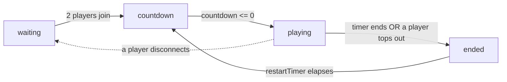

# Navigating the Codebase & Adding Mechanics

`[STATUS: ACTIVE]` `[SERVER]` `[CLIENT]` `[SHARED]`

This guide teaches you where things live and walks through adding a new mechanic end-to-end, using the existing shop powerups as the template.

---

## 1. The three zones

```text
SHARED (the contract both sides compile against)
  src/constants.ts   # numbers: board dims, costs, durations, gravity, lock delay
  src/types.ts       # shapes: GameState, PlayerState, TetrisPiece, ShopItem, MatchEvent
                     #         (also RE-EXPORTS everything from constants.ts)

SERVER (authoritative simulation — the source of truth)
  server.ts                 # wires Express + Socket.IO, starts GameManager
  server/GameManager.ts     # connections, 60 Hz loop, match state, shopPurchase
  server/tetris/engine.ts   # stepPlayer(): one player's simulation tick
  server/tetris/pieces.ts   # tetromino shapes + SRS kick tables

CLIENT (dumb renderer — sends inputs, draws GameState)
  src/App.tsx               # shell, keyboard, shop UI/roll logic, layouts
  src/hooks/useGameSocket.ts# transport
  src/components/*          # canvas board, controls, shop rail, layout
```

> [!IMPORTANT]
> **The shared boundary is sacred.** [src/constants.ts](../src/constants.ts) holds tuning numbers; [src/types.ts](../src/types.ts) holds shapes **and re-exports every constant** (see the big `export { … }` block at the bottom). The server imports from `../src/types.js` (note the compiled `.js` path). If you add a field to `PlayerState` or a new constant, both the server and client pick it up from this one place.

---

## 2. Where the simulation lives

The server owns reality. Two layers:

- **`GameManager`** ([server/GameManager.ts](../server/GameManager.ts)) — owns the single `gameState`, accepts socket events, and drives the match clock in `startLoop()` / `update()`.
- **`stepPlayer()`** ([server/tetris/engine.ts:708](../server/tetris/engine.ts)) — advances **one player** by one tick: spawns the next piece, applies input & gravity, resolves lock + line clears, sends garbage, and processes pending shop effects.

The match moves through four states inside `update()`:



> [!NOTE]
> `ended` only auto-restarts when `restartTimer` is set (game finished naturally or by topout). A mid-match disconnect drops straight back to `waiting`.

---

## 3. Recipe — add a shop powerup / mechanic

Every existing powerup (Elixir, Curtain, Magnet, Freeze, …) follows the same five-step path. Trace one of them while you build yours.

### Step A — tuning numbers in `constants.ts`

Add cost + behaviour constants in [src/constants.ts](../src/constants.ts), then **re-export them** from the block at the bottom of [src/types.ts](../src/types.ts):

```ts
// constants.ts
export const FREEZE_COST = 45;
export const FREEZE_DURATION_TICKS = 600; // 10s @ 60Hz
// types.ts — add FREEZE_COST, FREEZE_DURATION_TICKS to the export { … } list
```

### Step B — state fields on `PlayerState`

If the effect needs to persist across ticks, add a field to `PlayerState` in [src/types.ts](../src/types.ts) (e.g. `holdFrozenUntilTick?: number`). Initialise it in `makePlayer()` in [engine.ts](../server/tetris/engine.ts) if it needs a non-undefined default.

### Step C — handle the purchase in `GameManager`

The `shopPurchase` handler lives in `handleConnection` ([server/GameManager.ts:123](../server/GameManager.ts)). Two things to update:

1. Add the item's authoritative cost to the **`COSTS` map** (around [GameManager.ts:131](../server/GameManager.ts)).
2. Add an `else if (itemId === 'your-item')` branch that applies the effect — either **immediately** (mutate `opponent`/`buyer`) or by **queuing** a `PendingShopEffect` for later activation, plus push an `activeEffects` pill so the victim sees it.

```ts
} else if (itemId === 'frost-shift') {
  const until = this.gameState.tick + FREEZE_DURATION_TICKS;
  opponent.holdFrozenUntilTick = Math.max(opponent.holdFrozenUntilTick ?? 0, until);
  opponent.activeEffects.push({ id: `freeze-active-${this.gameState.tick}`, label: 'Frozen', /* … */ });
}
```

> [!WARNING]
> **Two cost tables must agree.** The server's `COSTS` map ([GameManager.ts:131](../server/GameManager.ts)) is authoritative — it deducts score and rejects if `buyer.score < cost`. The client's `SHOP_MOCK_POOL[].cost` ([App.tsx:43](../src/App.tsx)) only drives the UI. If they drift, the shop will *offer* a price the server then *charges differently*. Keep them in sync (both pull from the same `*_COST` constants).

### Step D — consume deferred effects in `stepPlayer`

For telegraphed/delayed effects, the pending-effects loop at the top of `stepPlayer()` ([engine.ts:722](../server/tetris/engine.ts)) fires them when `effect.activationTick <= gameState.tick`. Add an `else if (effect.itemId === 'your-item')` branch there. This is how Curtain telegraphs then drops, and how Wild Purge delays then deletes.

### Step E — surface it in the client shop

Add the item to `SHOP_MOCK_POOL` in [App.tsx:43](../src/App.tsx) (id, name, icon, `cost`, `tier`, `baseWeight`, colour classes, description; optional `synergyTargetId`/`synergyBoost`). The id **must match** the server's branch + `COSTS` key. The roll/weighting logic in App.tsx handles offering it.

> [!TIP]
> Self-buffs (affect the buyer, not the opponent) are listed in `SELF_SHOP_ITEMS` in the handler (e.g. `satellite-link`, `nova-charge`) so the "no opponent → reject" guard is skipped. Add yours there if it targets `buyer`.

See [docs/SHOP_POWERUPS.md](../docs/SHOP_POWERUPS.md) for the design specs of approved items.

---

## 4. Running & checking your change

- **Run:** `npm run dev`, open **two** tabs at `http://localhost:3000` (the match needs 2 players to leave `waiting`).
- **Type-check:** `npm run lint` (`tsc --noEmit`) — catches a missing re-export or a `PlayerState` field mismatch instantly.
- **Engine tests:** the simulation has unit coverage in [server/tetris/engine.test.ts](../server/tetris/engine.test.ts) — run them when you touch `engine.ts`.
- **Replays:** every finished match auto-saves a `.replay` JSON to `fixtures/replays` (see `saveReplay()` in [GameManager.ts](../server/GameManager.ts)); open it in the replay viewer to inspect a run frame-by-frame.

---

## See Also

- [socketio-gameplay.md](./socketio-gameplay.md) — the event contract your mechanic plugs into.
- [online-and-production.md](./online-and-production.md) — config + deployment.
- [AGENTS.md](../AGENTS.md) — project overview.
