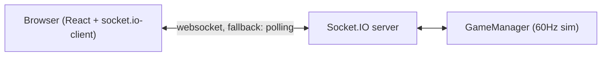
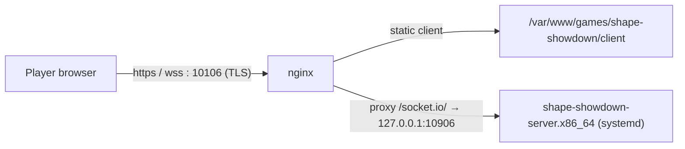

# How It Talks Online — Localhost & Production

`[STATUS: ACTIVE]` `[NETCODE]` `[DEPLOY]`

How the browser finds the game server, how that differs between local dev and the live VPS, and how a `git push` becomes a running game.

---

## 1. The shape of the connection



The client opens the socket in `useGameSocket` with `transports: ['websocket', 'polling']` ([src/hooks/useGameSocket.ts:105](../src/hooks/useGameSocket.ts)) — WebSocket preferred, long-polling as fallback for hostile networks.

---

## 2. How the client finds the server (URL resolution)

Before connecting, the client runs `resolveGameServerUrl()` ([useGameSocket.ts:37](../src/hooks/useGameSocket.ts)), a **5-step priority cascade**. First match wins:

| # | Source | Wins when |
|---|--------|-----------|
| 1 | `public/game-config.json` → `gameServerUrl` | non-empty full origin (e.g. `wss://skillcade.games:10106`) |
| 2 | `game-config.json` → `gameServerPort` (+ optional `gameServerHost`) | same host as the page, different port |
| 3 | `VITE_GAME_SERVER_URL` (build-time env) | set at build |
| 4 | `VITE_GAME_SERVER_PORT` (+ optional `VITE_GAME_SERVER_HOST`) | set at build |
| 5 | `window.location.origin` | nothing else set (default) |

> [!TIP]
> `game-config.json` is fetched **at runtime** (`cache: 'no-store'`) and shipped inside `dist/`. That means you can re-point a deployed client at a different server by editing one JSON file on the host — **no rebuild**. This is the recommended production knob.

---

## 3. Localhost

```bash
npm run dev          # bun server.ts  → http://localhost:3000
```

- [server.ts](../server.ts) creates Express + the Socket.IO `Server`, then — because `NODE_ENV !== 'production'` — **dynamically imports Vite and mounts it as middleware** (`vite.middlewares`). One process serves both the client and the socket. No separate Vite CLI.
- [public/game-config.json](../public/game-config.json) currently pins `gameServerUrl` to `http://localhost:3000`, so step 1 of the cascade resolves locally.
- Two players = **two tabs/windows** on the same origin.

> [!NOTE]
> Want the client served by Vite CLI while pointing at a separate server? `npm run dev:local` sets `VITE_GAME_SERVER_URL=http://localhost:3000` and runs `vite` standalone (step 3 of the cascade).

---

## 4. Configuration knobs

| File | Controls | Read when |
|------|----------|-----------|
| [config/server.json](../config/server.json) | `port`, `host`, `serveClient`, `replayKeyframeIntervalTicks` | Server start, from `process.cwd()` via [loadConfig.ts](../server/loadConfig.ts). `PORT` / `SERVE_CLIENT` / `REPLAY_KEYFRAME_INTERVAL_TICKS` env vars override the file. |
| [config/client.json](../config/client.json) | `baseUrl` → Vite `base` (asset path prefix) | **Client build time** — edit then rebuild. |
| [public/game-config.json](../public/game-config.json) | Runtime Socket.IO URL (see §2) | In the browser, at runtime — editable on host without rebuild. |

> [!NOTE]
> `serveClient` defaults to `false`: in production the **server does not serve the client** — nginx does. Set it `true` (or `npm run start:serve-client`) only if you want the Node server to also serve `dist/`.

---

## 5. Production (the live model)

The live deployment is the shared **skillcade.games Hetzner VPS** — **no Docker, no Node, no Bun installed on the box**. The game runs as a **compiled Bun binary under systemd**, fronted by **nginx** on a dedicated TLS port.



| Piece | Value |
|-------|-------|
| External port (nginx, TLS) | **10106** → internal **127.0.0.1:10906** |
| Server process | `shape-showdown-server.x86_64`, a `bun build --compile` binary under systemd unit `shape-showdown-server.service` (sets `PORT=10906`, `REPLAYS_DIR`, `REPLAY_KEYFRAME_INTERVAL_TICKS=1`, `NETCAST_HZ`) |
| Static client | served by nginx (`serveClient:false`); nginx also proxies `/socket.io/` |
| Public URL | `https://skillcade.games:10106/`, socket `wss://skillcade.games:10106` |
| CI | `.github/workflows/deploy.yml` (env `shape-showdown-prod`): setup-bun → `bun install --frozen-lockfile` → bake `public/game-config.json` → `build:client` + `build:replay` + `build:server:bin` → scp client/replay/binary → `sudo systemctl restart shape-showdown-server` |

> [!WARNING]
> `build:server:bin` **must** pass `--define 'process.env.NODE_ENV="production"'`. Without it the compiled binary freezes `NODE_ENV` at build time, runs the **dev branch** of [server.ts](../server.ts), tries to `import('vite')`, and crashes on the missing `@rollup/rollup-linux-x64-gnu` native module. The npm script already includes this flag — don't strip it.

> [!NOTE]
> **The Docker path is legacy.** [docs/superpowers/plans/2026-03-25-github-actions-deploy.md](../docs/superpowers/plans/2026-03-25-github-actions-deploy.md) describes an upstream `Dockerfile` + `docker-compose` + multi-stage deploy. That model is **not used** on this VPS (the box has no Docker). It's kept for upstream-merge context only.

### Static caching (nginx)

The nginx site uses an **SPA caching strategy**: `index.html` and `game-config.json` are served `Cache-Control: no-cache` (always revalidate, so a new deploy's hashed bundles load immediately), while `/assets/*` (content-hashed) are `public, max-age=31536000, immutable`.

> [!IMPORTANT]
> This rule exists because of a real bug: with no `Cache-Control`, browsers heuristically cached `index.html` and some phones ran **stale JS** after deploys (one phone shows the new layout, another the old). A device already holding a pre-fix stale `index.html` needs one hard-refresh to escape.

---

## See Also

- [socketio-gameplay.md](./socketio-gameplay.md) — what flows over the connection once it's open.
- [responsive-layouts.md](./responsive-layouts.md) — the cross-origin iframe embedding caveat on the hub.
- [AGENTS.md](../AGENTS.md) — deploy summary & env overrides.
