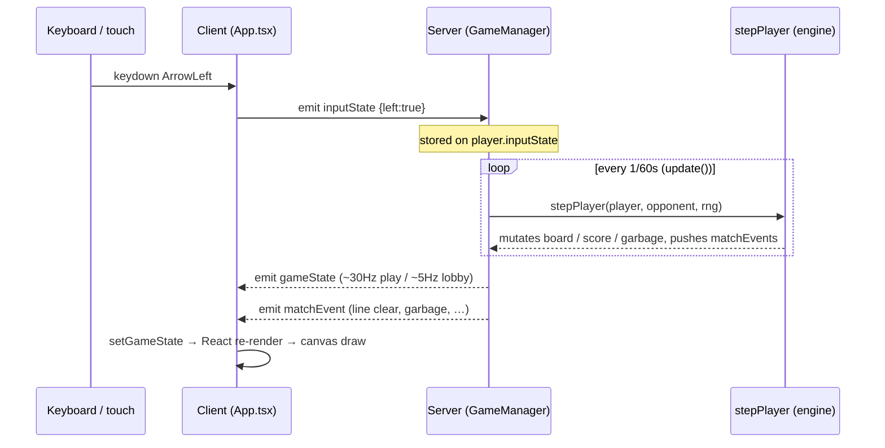

# Making Gameplay Work Under Socket.IO

`[STATUS: ACTIVE]` `[NETCODE]` `[SERVER]` `[CLIENT]`

Shape Showdown is **server-authoritative**: the client never simulates the game. It sends intent (inputs/actions), the server simulates, and the client renders whatever `GameState` comes back. This guide is the event contract plus the hard-won rules that keep it smooth on real phones.

---

## 1. The event contract

| Direction | Event | Payload | Handled in |
|-----------|-------|---------|------------|
| client → server | `inputState` | `{ left, right, softDrop }` (held keys) | [GameManager.ts:90](../server/GameManager.ts) |
| client → server | `action` | `'rotateCW' \| 'rotateCCW' \| 'hardDrop' \| 'hold'` | [GameManager.ts:108](../server/GameManager.ts) |
| client → server | `shopPurchase` | `itemId: string` | [GameManager.ts:123](../server/GameManager.ts) |
| server → client | `gameState` | full `GameState` snapshot | [useGameSocket.ts:119](../src/hooks/useGameSocket.ts) |
| server → client | `matchEvent` | `MatchEvent` (line clear / attack / garbage / topout) | [useGameSocket.ts:125](../src/hooks/useGameSocket.ts) |
| server → client | `error` | `"Game is full"` then disconnect | (3rd player) |

The client emitters are the three `useCallback`s returned by `useGameSocket`: `sendInputState`, `sendAction`, `sendShopPurchase` ([useGameSocket.ts:136](../src/hooks/useGameSocket.ts)). The `MatchEvent` union is defined in [types.ts:250](../src/types.ts).

---

## 2. The loop: sim vs broadcast are decoupled

- The **simulation is a fixed 60 Hz** `setInterval` in `startLoop()` ([GameManager.ts:340](../server/GameManager.ts)).
- The **broadcast rate is decoupled** from the sim: ~**30 Hz during play**, ~**5 Hz in lobby**, via `netcastEveryNTicks` / `lobbyNetcastEveryNTicks`, tunable live with the `NETCAST_HZ` env var. Emitting full state 60×/sec is brutal on phones (radio wake-ups, `JSON.parse`, React renders).
- A **status change always flushes immediately** (`statusChanged` bypasses the cadence) so lobby/countdown/ended transitions are never held back.
- Large frames are compressed: `perMessageDeflate: { threshold: 1024 }` ([server.ts:23](../server.ts)) — the repetitive full-board snapshot deflates to a fraction of its size; tiny frames skip the CPU cost.

---

## 3. Hard-won client rules

These three patterns each fixed a real production bug. Respect them.

> [!WARNING]
> **(a) Inputs come from a local `heldKeysRef`, never the server echo.** The keyboard handler tracks held keys in a local ref ([App.tsx:628](../src/App.tsx)) and emits from *that*, not from the server-echoed `gameState.inputState` (which lags ~RTT in prod). Deriving held state from the echo means holding one key while tapping another drops/resurrects keys ("stuck"/"ignored"). The handler also **ignores OS key-repeat** (re-emitting a key already down) and **clears all keys on `blur`**.

> [!WARNING]
> **(b) Shop rolls off the authoritative `linesCleared` delta, not `matchEvent`s.** The shop re-rolls when `gameState.players[me].linesCleared` increases ([App.tsx:657](../src/App.tsx)) — a cumulative counter in the 60 Hz state stream. It does **not** listen to transient `lineClear` `matchEvent`s, because in prod multiple same-tick events coalesce into one packet and React batches them, so `lastMatchEvent` ends up as some *other* event and the roll is silently lost. Diffing the counter is immune to batching and dropped frames.

> [!NOTE]
> **(c) Use `gameState` directly — no `structuredClone`.** Socket.IO hands you a freshly-deserialized object per message, so cloning it is pure wasted CPU/GC (deep-cloning two boards up to 60×/sec). `useGameSocket` calls `setGameState(state)` directly ([useGameSocket.ts:119](../src/hooks/useGameSocket.ts)). An older comment in AGENTS.md says to clone — that advice is stale.

`matchEvent`s are still used — but only for **UI-only feedback** (screen shakes on line-clear/garbage, the event label pill), never for authoritative state.

---

## 4. Adding a new networked event

1. **Client emitter:** add a `socket?.emit('myEvent', payload)` `useCallback` in [useGameSocket.ts](../src/hooks/useGameSocket.ts) and return it.
2. **Server handler:** add `socket.on('myEvent', …)` inside `handleConnection` ([GameManager.ts:80](../server/GameManager.ts)).
3. **Validate server-side:** guard on `this.gameState.status === 'playing'` and `this.gameState.players[socket.id]` before mutating — clients are untrusted. (See how `action` and `shopPurchase` reject out-of-state input.)
4. If it changes simulation state, let `stepPlayer` consume it next tick rather than mutating mid-handler, so behaviour stays deterministic and replay-able.

> [!TIP]
> Because the server records every `inputState`/`action` into `activeReplay.inputs` keyed by tick ([GameManager.ts:98](../server/GameManager.ts)), a deterministic engine means a match can be re-simulated from its seed + input log. Keep new mechanics deterministic (drive randomness through the seeded `rng`, not `Math.random()` in the engine) to preserve this.

---

## See Also

- [codebase-navigation.md](./codebase-navigation.md) — where `stepPlayer` and the handlers live.
- [online-and-production.md](./online-and-production.md) — `NETCAST_HZ` and the connection setup.
- [responsive-layouts.md](./responsive-layouts.md) — why render cost (and thus broadcast rate) matters on phones.
