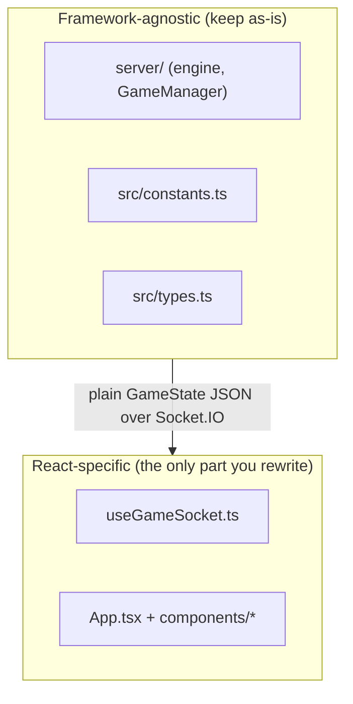

# The Other TS Code & Swapping the UI Framework

`[STATUS: ACTIVE]` `[CLIENT]` `[ARCHITECTURE]`

A tour of the client-side TypeScript that **isn't** game logic, and a concrete recipe for swapping React out for Vue (or anything else). The short version: most of this codebase doesn't care what view framework you use.

---

## 1. The non-gameplay client code

```text
src/
  main.tsx                # mounts <App/> into #root (the only React-DOM entry)
  App.tsx                 # the shell: socket wiring, keyboard handler, shop reducer,
                          #            both responsive layouts, overlays (countdown/end)
  hooks/useGameSocket.ts  # transport: resolves server URL, opens socket, exposes
                          #            gameState/myId/matchEvent + send* emitters
  components/
    GameField.tsx         # <canvas> renderer for one board (plain Canvas 2D API)
    OpponentMiniField.tsx # small read-only opponent board
    MobileControls.tsx    # touch buttons → onInput / onAction / onShopPress
    ShopRail.tsx          # shop offers UI + cycle/confirm interaction
    GameFieldsLayout.tsx  # desktop scale-to-fit + PlayfieldCellSizeContext provider
    playfieldCellSizeContext.tsx # the shared cell-size context
  ReplayApp.tsx, replay.tsx    # standalone replay viewer (separate Vite entry,
                               #   built via vite.replay.config.mjs)
```

A few things worth knowing:

- **`App.tsx` is the brain of the client.** It holds the keyboard listeners, the `useReducer`-based shop state machine (offers, cycling, purchase, synergy weighting), and both layout trees. It's large because it's the single orchestrator.
- **`GameField` draws on a `<canvas>`** with the plain Canvas 2D API — it's framework-glue around imperative drawing, not React-specific rendering.
- **The replay viewer is a second app** with its own entry (`replay.tsx` / `ReplayApp.tsx`) and Vite config (`vite.replay.config.mjs`), reading the `.replay` JSON the server writes.

---

## 2. The portability seam



> [!IMPORTANT]
> Everything in **`server/`**, **`src/constants.ts`**, and **`src/types.ts`** is pure TypeScript with **zero React imports**. A Vue (or Svelte, or Solid) port keeps all of it untouched. Only the **view layer** — the React components and the `useGameSocket` hook — is framework-specific. The data crossing the seam is plain `GameState` JSON, so the view is a "dumb render" of server truth.

---

## 3. Recipe — React → Vue

> [!TIP]
> Because the view only renders server state and emits a handful of events, the swap is mostly **mechanical translation**, not redesign. Do it component-by-component behind the unchanged socket layer.

**(a) Swap the Vite plugin.** In [vite.config.mjs:45](../vite.config.mjs), replace `@vitejs/plugin-react` with `@vitejs/plugin-vue` (and add `vue` deps). Tailwind v4 (`@tailwindcss/vite`) stays — it's framework-agnostic, so every class string in the components carries over verbatim.

**(b) Rewrite `useGameSocket` as a Vue composable.** Same logic, Vue primitives — return the same shape so call sites barely change:

```ts
// useGameSocket.ts (Vue)
export function useGameSocket() {
  const gameState = ref<GameState | null>(null);
  const myId = ref<string | null>(null);
  const lastMatchEvent = ref<MatchEvent | null>(null);
  let socket: Socket | null = null;

  onMounted(async () => {
    const url = await resolveGameServerUrl();   // unchanged
    socket = io(url, { transports: ['websocket', 'polling'] });
    socket.on('connect', () => (myId.value = socket?.id ?? null));
    socket.on('gameState', (s) => (gameState.value = s));   // still no clone
    socket.on('matchEvent', (e) => (lastMatchEvent.value = e));
  });
  onUnmounted(() => socket?.close());

  return { gameState, myId, lastMatchEvent,
           sendInputState: (i: InputState) => socket?.emit('inputState', i),
           sendAction:     (a: ActionType) => socket?.emit('action', a),
           sendShopPurchase:(id: string)   => socket?.emit('shopPurchase', id) };
}
```

`resolveGameServerUrl()` itself has **no React** in it — copy it across unchanged.

**(c) Port components to SFCs.** Each `.tsx` becomes a `.vue` single-file component. `GameField`'s canvas drawing moves nearly verbatim — keep the same draw function, drive it from `onMounted` + a `watch` on `props.player` instead of `useEffect`. Replace `forwardRef`/`useImperativeHandle` (the `shake()` method) with `defineExpose`.

**(d) Replace the shop state machine.** The `useReducer` shop machine in `App.tsx` maps cleanly to a **Pinia store** (or a `reactive()` object with the same actions: `RESET`, `LINE_CLEAR_ROLL`, `START_CYCLE`, `PURCHASE`, …). The pure draw/weighting helpers (`drawWeightedShopOffers`, `synergyMultiplier`, etc.) are plain functions — copy them as-is.

**(e) Animation & layout.** Swap `motion/react` for `@vueuse/motion` or plain CSS keyframes (the countdown/overlay animations are simple). The `ResizeObserver` sizing logic ([GameFieldsLayout.tsx](../src/components/GameFieldsLayout.tsx), [App.tsx:579](../src/App.tsx)) ports directly — provide the cell size via Vue `provide`/`inject` instead of a React Context.

> [!WARNING]
> Keep the [responsive-layouts.md](./responsive-layouts.md) gotchas in the port: the sizing effect must run **after** the socket connects (the `[gameState != null]` dependency becomes a `watch(() => gameState.value != null)`), or the board stays stuck at its default size — the exact same bug, in Vue.

---

## See Also

- [codebase-navigation.md](./codebase-navigation.md) — the shared `constants.ts` / `types.ts` boundary you keep.
- [socketio-gameplay.md](./socketio-gameplay.md) — the event contract the new view layer must honour.
- [responsive-layouts.md](./responsive-layouts.md) — sizing rules to preserve across the port.
