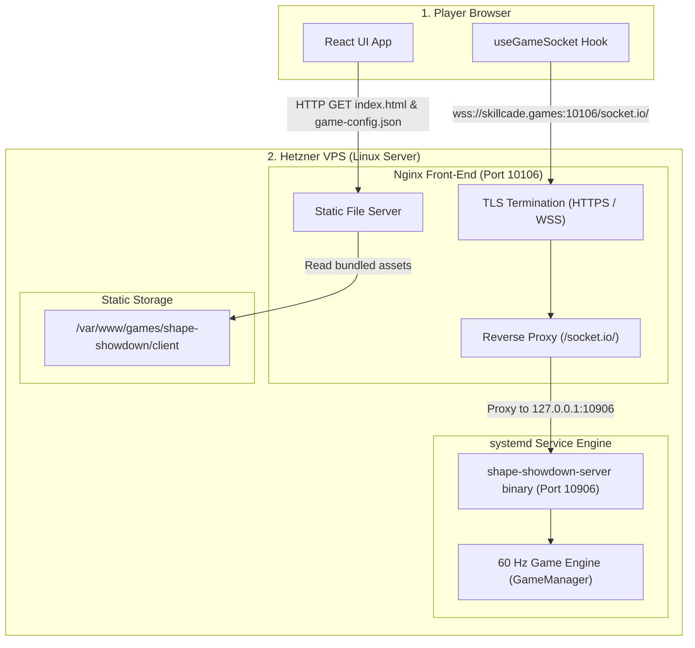
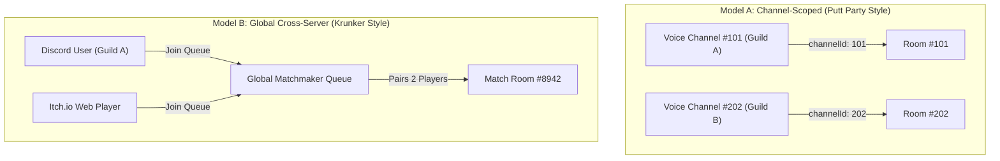
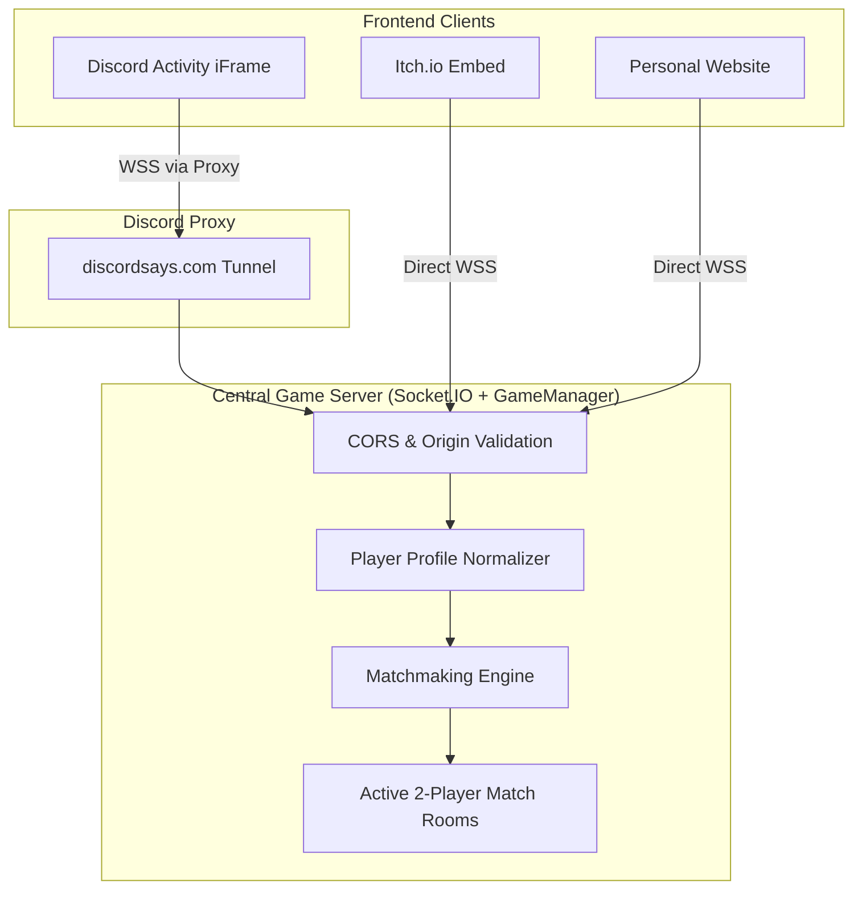
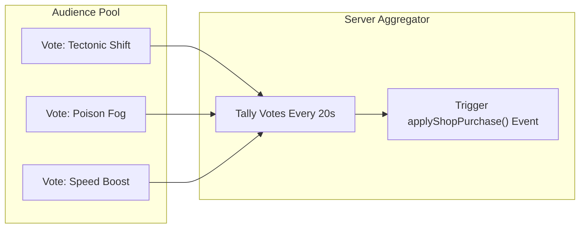

# Shape Showdown: Architecture, Discord Pivot & Vision Strategy

> **Document Status:** Active Reference  
> **Topic:** Infrastructure Evolution, Discord Activities Integration, Cross-Platform Architecture, Scaling ($N > 2$), Legal/IP Boundaries, and Project Vision.

---

## Table of Contents
1. [Production Infrastructure Baseline (Hetzner VPS Setup)](#1-production-infrastructure-baseline-hetzner-vps-setup)
2. [Infrastructure Comparison: Hetzner VPS vs. Edgegap](#2-infrastructure-comparison-hetzner-vps-vs-edgegap)
3. [Discord Activities Platform Evaluation](#3-discord-activities-platform-evaluation)
   - [Monetization](#31-monetization)
   - [Intellectual Property & Rights](#32-intellectual-property--rights)
   - [Platform Accessibility](#33-platform-accessibility)
   - [Hosting Realities](#34-hosting-realities)
4. [Matchmaking Paradigms: Channel-Scoped vs. Global Cross-Server](#4-matchmaking-paradigms-channel-scoped-vs-global-cross-server)
5. [Cross-Platform Architecture (Discord + Itch.io / Portfolio)](#5-cross-platform-architecture-discord--itchio--portfolio)
   - [Unified Player Identity](#51-unified-player-identity)
   - [Matchmaking Modes](#52-matchmaking-modes)
   - [Server Handshake & CORS](#53-server-handshake--cors)
6. [Future Game Modes, Scaling & Spectating](#6-future-game-modes-scaling--spectating)
   - [N-Player Battle Royale & Garbage Targeting](#61-n-player-battle-royale--garbage-targeting)
   - [Bandwidth & Rendering Level-of-Detail (LOD)](#62-bandwidth--rendering-level-of-detail-lod)
   - [Dedicated Spectator Pipeline](#63-dedicated-spectator-pipeline)
   - [Audience Interaction System](#64-audience-interaction-system)
   - [Mid-Match Channel Drop-In](#65-mid-match-channel-drop-in)
7. [Legal & Intellectual Property Risk Analysis (Tetris Clone Concerns)](#7-legal--intellectual-property-risk-analysis-tetris-clone-concerns)
   - [Unprotectable Mechanics vs. Protectable Expression](#71-unprotectable-mechanics-vs-protectable-expression)
   - [Precedent: Tetris Holding, LLC v. Xio Interactive, Inc.](#72-precedent-tetris-holding-llc-v-xio-interactive-inc)
   - [Shape Showdown Safe Differentiation Strategy](#73-shape-showdown-safe-differentiation-strategy)
8. [Strategic Concerns & Phased Execution Roadmap](#8-strategic-concerns--phased-execution-roadmap)

---

## 1. Production Infrastructure Baseline (Hetzner VPS Setup)

### System Architecture Flow
```
Browser → nginx/TLS :10106 → static files or Socket.IO proxy → systemd-managed game binary :10906
```



### Key Components & Mechanics
- **Hetzner VPS:** Dedicated virtual server hosting the live game environment.
- **Nginx Web Server:** Terminates TLS encryption on public port `10106` and serves the pre-compiled React static client.
- **Socket.IO Reverse Proxy:** Nginx forwards incoming `/socket.io/` WebSocket connections from `wss://skillcade.games:10106` directly to local port `127.0.0.1:10906`.
- **Compiled Bun Executable:** The server is compiled via `bun build --compile --define 'process.env.NODE_ENV="production"' server.ts` into `shape-showdown-server.x86_64`. It runs as a `systemd` background service (`shape-showdown-server.service`). No Node, Bun, or Docker installation is needed on the VPS.
- **Dynamic URL Resolution:** `useGameSocket.ts` checks `public/game-config.json` at runtime (`cache: 'no-store'`). Server endpoints can be redirected without rebuilding JavaScript bundles.
- **CI/CD Pipeline:** GitHub Actions builds client/replay bundles and the standalone binary, uploads via SCP, and restarts the systemd service via SSH.

---

## 2. Infrastructure Comparison: Hetzner VPS vs. Edgegap

| Aspect | Shape Showdown (Current Setup) | Edgegap Model |
| :--- | :--- | :--- |
| **Server Lifecycle** | **Always-On:** Single long-running `systemd` process on one VPS. | **On-Demand:** Dynamically provisions a Docker container per match and destroys it upon completion. |
| **Packaging Target** | **Single Executable:** `bun build --compile` native binary. | **Container Image:** Dockerfile pushed to a container registry. |
| **Routing & Geo-Location** | **Fixed Location:** Single datacenter in Europe. Players worldwide route to this origin. | **Multi-Region Edge:** Evaluates player ping and provisions containers geographically central to participants. |
| **Cost Structure** | **Fixed Monthly Rate:** Predictable flat monthly hosting fee. | **Usage-Based:** Metered per minute/hour of container runtime and bandwidth. |
| **Matchmaking Flow** | **Static Port:** Direct WebSocket connection to `wss://skillcade.games:10106`. | **Dynamic Allocation:** Matchmaker calls Edgegap REST API → receives dynamic IP and port. |
| **Infrastructure Complexity** | **Low:** Single Nginx config, one systemd unit, simple SCP script. | **Moderate/High:** Requires Docker orchestration, container registries, and API-based lifecycle hooks. |

---

## 3. Discord Activities Platform Evaluation

### 3.1 Monetization
- **In-App Purchases (IAP):** Managed via Discord Embedded App SDK Monetization APIs.
- **SKU Types:** Consumables (re-rolls, powerup charges), Durables (skins, boards, audio themes), Subscriptions.
- **Revenue Split:** 15% platform fee to Discord on Desktop/Web (85% developer payout). Mobile app store cuts apply on iOS/Android before Discord splits.
- **Policy:** In-app transactions inside Discord must use Discord native monetization. Off-platform payment links are restricted.
- **Onboarding:** Requires developer team identity verification (KYC) and Stripe Payout integration in the Discord Developer Portal.

### 3.2 Intellectual Property & Rights
- **Ownership:** The developer retains 100% intellectual property ownership of all source code, art, audio, and trademarks.
- **Licensing:** The developer grants Discord a non-exclusive distribution license to embed and stream the web app in the client.
- **Data Compliance:** Player context (`userId`, `username`, `avatar`) is provided via OAuth2. Developers must follow GDPR and Discord Developer Data Terms.
- **Content Standards:** Activities must comply with Community Guidelines (no real-money gambling or explicit adult content).

### 3.3 Platform Accessibility
- **Cross-Platform:** Runs on Desktop (Windows, macOS, Linux), Web (`discord.com`), and Mobile (iOS & Android).
- **Embedded Webview:** Discord loads the client application inside an `iframe`.
- **Discord Proxy (`discordsays.com`):** Discord proxies HTTP and WebSocket traffic through `https://<app-id>.discordsays.com`, automating SSL and preventing cross-origin security errors.

### 3.4 Hosting Realities
> [!IMPORTANT]
> **Discord does NOT host game backend servers.**  
> Discord only hosts the frontend client iframe embed. You must host an authoritative game server (`server.ts` + `GameManager.ts`) on an external cloud host (e.g. AWS, Fly.io, Railway, Render, or Hetzner).

---

## 4. Matchmaking Paradigms: Channel-Scoped vs. Global Cross-Server



- **Channel-Scoped (Putt Party):** Automatically groups players sharing the same Discord `channelId` or `instanceId`. Ideal for voice-channel party sessions.
- **Global Cross-Server (Krunker):** Ignores channel boundaries. Pairs players across different Discord guilds and external web clients via a centralized matchmaking queue.

---

## 5. Cross-Platform Architecture (Discord + Itch.io / Portfolio)



### 5.1 Unified Player Identity
```typescript
export interface PlayerProfile {
  id: string;              // Discord User ID or random UUID
  displayName: string;     // Discord username or "Guest_XXXX"
  avatarUrl?: string;      // Discord CDN URL or procedural fallback
  platform: 'discord' | 'web';
}
```

### 5.2 Matchmaking Modes
1. **Discord Channel Auto-Join:** Automatic pairing for players within the same voice channel.
2. **Private Room Codes (Cross-Platform):** A 4-character room code (e.g. `X7K2`) generated on any client allowing Discord and web users to join the same match room.
3. **Global Quickplay Queue:** Cross-platform matchmaking pool matching any two active players.

### 5.3 Server Handshake & CORS
Socket.IO accepts multiple trusted origins:
```typescript
const io = new Server(httpServer, {
  cors: {
    origin: [
      /\.discordsays\.com$/,
      "https://itch.io",
      "https://html-classic.itch.zone",
      "https://yourportfolio.com"
    ]
  }
});
```

---

## 6. Future Game Modes, Scaling & Spectating

### 6.1 N-Player Battle Royale & Garbage Targeting
In matches with $N > 2$ players, attack targeting must be dynamic:
- **Random:** Distributes lines evenly among active opponents.
- **KO Hunting:** Targets the player closest to topping out (highest stack height).
- **Payback:** Targets opponents who recently sent garbage to you.
- **Leader Target:** Targets the player with the highest score or badge count.

### 6.2 Bandwidth & Rendering Level-of-Detail (LOD)
To prevent network saturation and mobile client frame drops:
- **Tier 1 (Local Player):** Full 60 Hz simulation and rendering.
- **Tier 2 (Targeted Opponents):** Full field rendering updated at 30 Hz.
- **Tier 3 (Background Players):** Compact mini-HUD cards (stack height, KO status) updated at 2–5 Hz.

### 6.3 Dedicated Spectator Pipeline
- Distinguishes `PLAYER` from `SPECTATOR` socket roles.
- Spectators emit no `inputState` frames.
- Spectators receive compressed 15 Hz delta snapshots via non-blocking Socket.IO room broadcasts (`room:spectators:<roomId>`).

### 6.4 Audience Interaction System

- Audience members vote on global environmental hazards or gift powerups to struggling players.

### 6.5 Mid-Match Channel Drop-In
- **Late-Spawn Handicap:** Spawns a latecomer immediately with garbage matching the active average stack height.
- **Spectator Queue:** Enters the player as a spectator until the active round concludes, spawning them in Round $N+1$.
- **Wave Join:** Spawns late joiners at scheduled survival wave intervals.

---

## 7. Legal & Intellectual Property Risk Analysis (Tetris Clone Concerns)

> *Disclaimer: Informational analysis based on video game IP case law; not formal legal advice.*

### 7.1 Unprotectable Mechanics vs. Protectable Expression
Under US Copyright Law (17 U.S.C. § 102(b)), **game mechanics, rules, and concepts are not copyrightable**. Anyone may legally develop a game featuring falling polyomino shapes, line clears, increasing gravity, and grid-based playfields.

### 7.2 Precedent: *Tetris Holding, LLC v. Xio Interactive, Inc. (2012)*
The court established that while the *idea* of Tetris is free to use, copying the exact expressive presentation constitutes copyright and trade dress infringement:
- **Trademarks:** The names "Tetris", "Tetrimino", "Tetris 99", and official logos are protected trademarks.
- **Music & Sound:** The soundtrack (*Korobeiniki*) and official audio clips are strictly protected.
- **Guideline Color Mappings:** Standard piece-color mappings (I=Cyan, O=Yellow, T=Purple, L=Orange, J=Blue, S=Green, Z=Red) combined with 10×20 board styling form protected trade dress.

### 7.3 Shape Showdown Safe Differentiation Strategy
1. **Unique Mechanics:** Real-time shop rolls, poison blocks, Elixir, Magnet, Tectonic Shift, and Satellite create distinct gameplay.
2. **Original Branding:** The project is named *Shape Showdown* / *Bubble Blitzers*.
3. **Custom Visual Styling:** Distinctive board frames, procedural watchers, and custom Voronoi/geometric block shaders avoid copying official visual styles.
4. **Original Audio:** Uses custom, royalty-free, or original sound design.

---

## 8. Strategic Concerns & Phased Execution Roadmap

### Identified Project Risks
1. **Player Base Fragmentation:** Avoid launching multiple competing queues while the initial player base is growing.
2. **Mobile Webview Performance:** Avoid rendering 10+ full-fidelity canvas fields on mobile Discord clients.
3. **Event Loop Latency:** Synchronous 60 Hz tick calculations must be decoupled from network serialization as player count grows.
4. **Auth Failure Handling:** Ensure a graceful fallback to Guest sessions if Discord OAuth handshakes time out.

### Phased Execution Roadmap
```
Phase 1: Foundation & Platform Integration
  ├── Integrate @discord/embedded-app-sdk into App.tsx
  ├── Configure Socket.IO multi-origin CORS in server.ts
  └── Implement Guest vs. Discord OAuth identity resolution

Phase 2: Cross-Platform Matchmaking
  ├── Implement Private Room Codes (e.g. 4-letter alphanumeric keys)
  ├── Implement Discord Voice Channel auto-join routing
  └── Build Global Quickplay matchmaking queue

Phase 3: Multiplayer Engine Scaling ($N > 2$)
  ├── Refactor GameManager.ts from fixed 2-player array to Map<string, PlayerState>
  ├── Implement garbage targeting router (Random, KO Hunting, Payback)
  └── Build 3-Tier Level-of-Detail (LOD) UI rendering

Phase 4: Spectating & Audience Systems
  ├── Implement dedicated spectator delta netcast pipeline
  ├── Add mid-match drop-in spectator queueing
  └── Build audience voting and global hazard triggers
```
