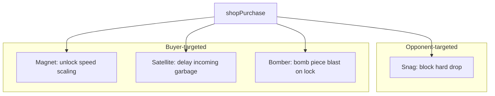

# Shop powerups — design reference

Living design doc for Shape Showdown shop items. Implementation status is noted per item; specs here are authoritative for **approved next work**.

**Related:** shipped items wired in [`src/App.tsx`](../src/App.tsx) (`SHOP_MOCK_POOL`), [`server/GameManager.ts`](../server/GameManager.ts) (`shopPurchase`), [`server/tetris/engine.ts`](../server/tetris/engine.ts) (effects). Runtime prices are defined in [`src/shop/shopPricing.ts`](../src/shop/shopPricing.ts) and described in [`POWERUP_PRICING_CURVE.md`](./POWERUP_PRICING_CURVE.md).

---

## Core economy

| Rule | Detail |
|------|--------|
| **Currency** | Buyer spends wallet funds (`buyer.funds`); the server deducts the resolved price after validating the purchase. |
| **Shop rolls** | Off authoritative `linesCleared` per player, not transient match events. |
| **Targets** | Most items debuff the **opponent**; new approved items introduce **self** buffs (first time in roster). |
| **Fairness** | Board mutations on the victim must **not** grant line clears, score, or gravity collapse unless explicitly designed (see Wild Purge). |
| **Bag pairing** | `synergyTargetId` + `synergyBoost` on tier-2 items; owning the partner raises draw weight in [`App.tsx`](../src/App.tsx). |
| **Telegraphs** | Debuffs that need reaction time use `pendingShopEffects` + `activeEffects` pills. |

### Runtime pricing

Each item has an independent uncapped curve in [`src/shop/shopPricing.ts`](../src/shop/shopPricing.ts). The first successful purchase at a level starts a 20-second engagement window; purchases within the allowance use the same price. Allowance exhaustion and timer expiration both advance that item one level, without changing any other item. The server resolves and charges the dynamic price; client affordability is only a presentation preflight. See [`POWERUP_PRICING_CURVE.md`](./POWERUP_PRICING_CURVE.md) for the complete curve policy.

### Price bands (current)

| Band | Range | Examples |
|------|-------|----------|
| Cheap tempo | ~45–70 | Freeze, Sticky, Elixir, Wild Purge |
| Structural attack | ~120–140 | Re-Trim, Curtain |
| **Expensive self** | **~100–130** | **Magnet** (approved) |
| **Cheap attack** | **~60** | **Snag** (approved) |

---

## Shipped (opponent attacks)

| ID | Name | Cost | Effect (summary) |
|----|------|------|------------------|
| `retrim` | Re-Trim | 120 | Swap line up 1 (permanent), telegraphed |
| `curtain` | Curtain | 140 | Frost/blackout below swap line ~4s; pairs `retrim` |
| `frost-shift` | Freeze | 45 | No hold store/swap ~10s |
| `elixir-pulse` | Elixir | 55 | Poison active/next piece, 4-variant spread |
| `vortex-step` | Wild Purge | 70 | Random poison colour → holes, no gravity/score; pairs `elixir-pulse` |
| `quickstep-clock` | Sticky | 50 | Active piece lock-reset cap = 2 |
| `gravity-lure` | Magnet | 125 | Opponent gravity: +2 per permanent buy (max +6), then +1 temp/piece; rainbow edge on fall |
| `fortify-frame` | Snag | 60 | Opponent cannot hard-drop current/next piece; pairs Magnet |
| `satellite-link` | Satellite | 80 | Self: arms on buy, activates when garbage is queued — +90 ticks on queue; +90 on new garbage for 10s |
| `nova-charge` | Bomber | 110 | Self: next piece shows 💣; radius-2 circle blast on lock (holes only) |

---

## Rejected / deprioritized

| Idea | Slot | Reason |
|------|------|--------|
| **Shroud** (hide next queue) | `target-lock` 🎯 | Meh — need a different concept for this slot later |
| **Rush** (halve lock delay) | `ember-flare` 🔥 | Eh |
| **Anchor** (opponent faster fall timed debuff) | `gravity-lure` | Superseded by **Magnet** self speed-gate design |
| **Jam** (delay opponent garbage) | `satellite-link` | Repurposed to **self** garbage delay |
| **Fault line** (opponent row delete) | `nova-charge` | Repurposed to **Bomber** self |
| Scramble, Spill, Antibody, Overclock | various | Not wanted / indifferent for now |

**`target-lock` 🎯** — slot open; replacement TBD (not queue hide).

**`ember-flare` 🔥** — slot open or low priority.

**`spark-overclock` ⚡** — tier-1 placeholder; no approved design.

---

## Synergy map (updated)

| Partner | Item | Theme |
|---------|------|--------|
| `retrim` | `curtain` | Geometry + vision (shipped) |
| `elixir-pulse` | `vortex-step` | Poison + purge (shipped) |
| `elixir-pulse` | `wildcard-four` | Poison + copied poison shape (shipped) |
| `quickstep-clock` | — | Sticky; no new pair required |

Contagion (`storage-toxin`) and Snag (`fortify-frame`) remain purchasable standalone powerups. They do not receive or consume Elixir/Magnet synergy seeds.

### Bot pair purchasing model

Pair-aware harness bots keep shop purchasing separate from board movement and advance through four states:

1. `setup` — wait until the setup item is highlighted and affordable, then purchase it.
2. `waiting-for-activation` — when required, wait for the setup effect to become visible in the player-limited observation.
3. `payoff` — wait until the payoff item is highlighted and affordable, then purchase it.
4. `complete` — stop, or return to `setup` for a full-session repeating policy.

Re-Trim immediately satisfies Curtain's setup requirement. Elixir only satisfies Wild Purge or Wildcard +4 after poison is visible on the opponent's board; accepting the Elixir purchase alone is not treated as activation.

---

## Suggested implementation order

1. **Snag** — small flag in `processActions`; standalone powerup.
2. **Satellite** — buyer branch in `GameManager`, mutate `pendingGarbage`.
3. **Magnet** — match-wide speed gate + `HORIZONTAL_SPEED_THRESHOLDS` / gravity hookup.
4. **Bomber** — engine blast + client bomb skin.

---

## Architecture sketch (approved items)

---

*Last updated from powerup catalog review — Magnet speed-gate, self Satellite/Bomber, Snag + pair, rejections recorded.*
